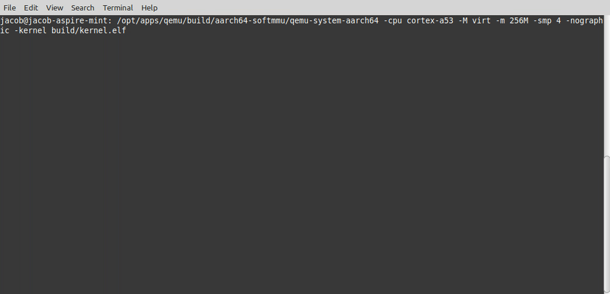

# Learning μKernel Operating System (LuKOS)

This repo contains the all design thoughts and implementation of what I'm calling LμKOS (pronounced like the name Lucas). This project is purely for me to explore microkernel implementation on modern architecutures. You'll find the design documents in the design directory, and the implementation source in the implementation directory. 

## Background and Motivation
I love working in the embdedded systems world, and this love for industry extends into my hobbies as well. I am continually trying to learn and improve my skillsets via my hobbies, and one area I am was not very strong in was microkernels. I decided since I know intimatelt how monolithic kernels get put together, but not so much the microkernel variety, I'd build one to learn how it works! For more info, check out my blog at [JacobNCalvert.com](https://jacobncalvert.com).

## Goals
- [x] Understand what makes a microkernel different in practice than a monolithic kernel
- [x] Understand some of the pros and cons of a microkernel
- [x] Design and implement a basic microkernel with some services
- [x] Have fun!

## Documentation
Documentation for what I've done is a work in progress. Start with the [000-readme.md](./design/000-readme.md) file in the design directory. I'll add more documentation as I check things off my list. 

## License
Make note of the license for this project in the [implementation directory.](./implementation/LICENSE.txt).

## Some Screenshots and Stuff

